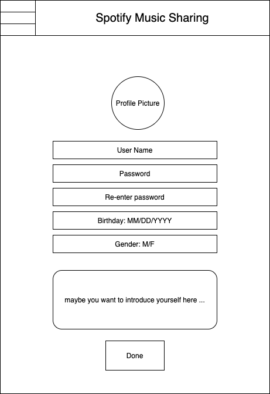
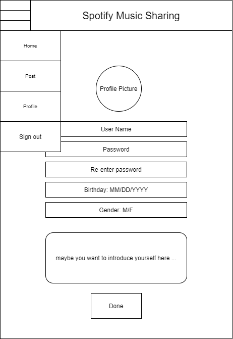
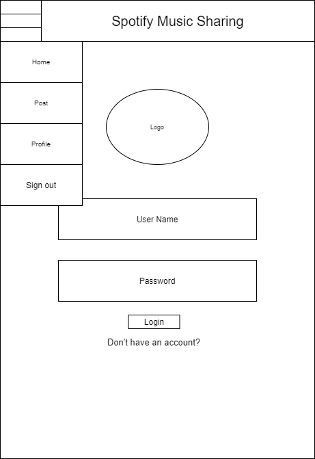
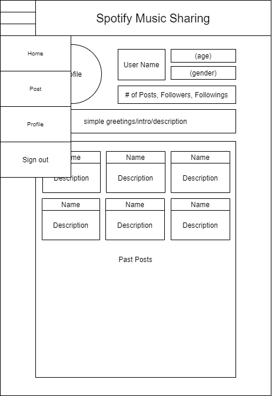
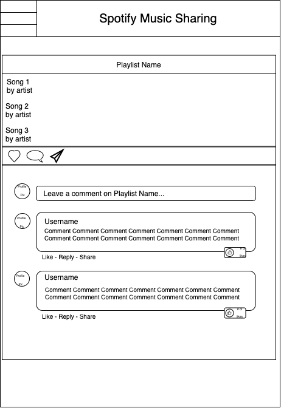
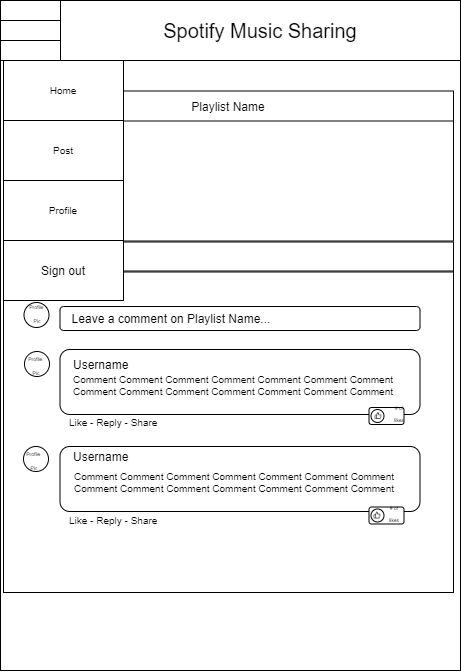
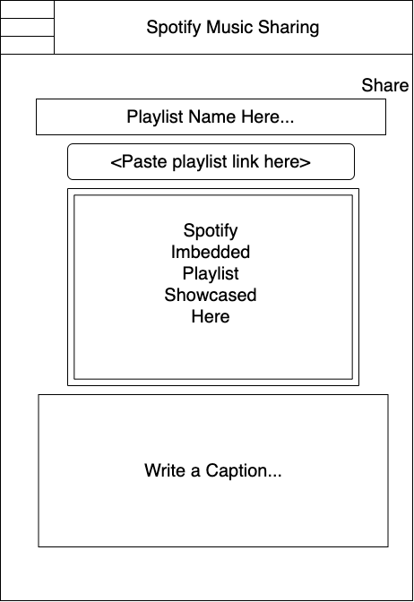
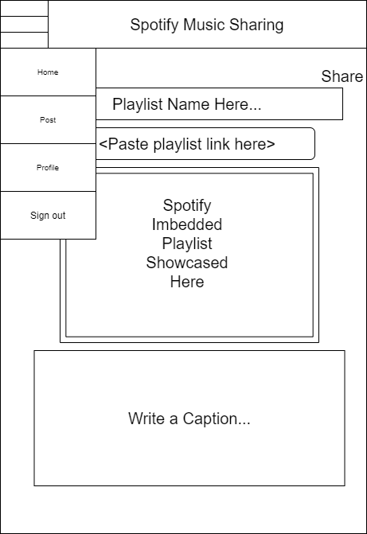

# User Experience Design

## Prototype

You can view the [prototype](ux-design/prototype) or view the actual prototype following this [link]()

## App Map

## Wireframes
### Home page
.png)
 + Hamburger.png)
### Create an account

### Log in

### Profile

### Detailed Post

### Create a new post

