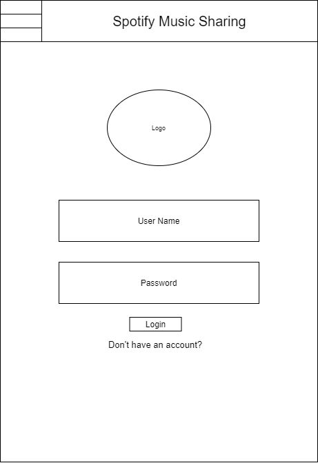
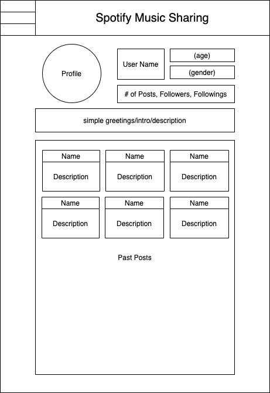

# User Experience Design

## App Map

For our project, there are a few pages that are important. Users can start from the home page, then jump to login page, a detailed post page, their profile, or create new post. Also, users access the "create an account" page from login page. Besides, users are able to access a detailed post from their profile too.

## Wireframe

### Home Page

.png)

In this page, the users can see a list of posts(The name of the user that post it, the date it is posted, and three songs in the playlist attached to the post). Also, user can search post with the search bar.

### Login

### Create an Account

### Profile

When the user click a post on their profile, he will be directed to the detailed post.

### Detailed Post

Users can leave comments within the detailed post page.

### Create New Post

Users can create new post with link of a spotify playlist. They can also write a Caption and give the post a name.

### Hamburger Icon

We create a hamburger icon for every page. Therefore, the user can direct to home, profile, or create new post. Also, they can sign out with the hamburger icon.
Here is an example when the user open the hamburger icon: _Hamburger.png)

## Prototype

You can view the [prototype](ux-design/prototype) or view the actual prototype following this [link](https://invis.io/FD11VQOSHSK5).
